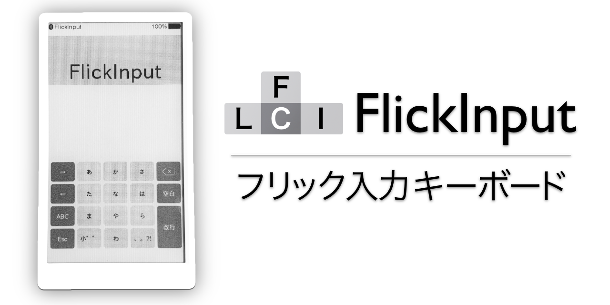

# FlickInput

BLE keyboard for Japanese Kana typing.

## BLEフリック入力キーボード

M5Paperを用いた軽量なフリック入力キーボードファームウェアです。
片手でPCに文字入力を素早く行うことができます。

## 使い方

サイドボタンを長押しすると電源が入り、起動が完了するとロゴが表示されます。
PCやMacでBluetoothデバイスを検索し、FlickInputを見つけてペアリングをするだけで準備完了です。

左上のペアリングアイコンが黒くなっていればペアリングができているので、キーをタップしたりフリックしたりしてみてください。
上下左右にフリックすると入力される文字は、キーを長押しすることで確認できます。

サイドボタンは上下の操作が上下のカーソル入力に対応していて、押し込みはEnterキーの入力になっています。変換候補の選択に便利です。

## 設定

サイドボタンを長押しすると設定メニューが現れます。
かな/ローマ字の入力方法の切り替えやレイアウトの変更ができます。

## 導入手順

PlatformIOの環境構築をしてこのリポジトリを開き、PCに接続した状態でUploadを選択することでビルドと書き込みが完了します。
詳しくは[platformio.org](https://platformio.org/)やその他サイトを参考にしてください。

## 実装済みの機能

チェックマークがついているものが実装済み及び動作確認済みです。

- [ ] デバイスとファームウェア
  - [x] バッテリー残量表示
  - [x] デバイス上下反転
  - [ ] 自動パワーオフ/スリープ機能
  - [ ] ペアリング解除
  - [ ] OTAファームウェア更新
- [ ] BLEプロトコル実装
  - [x] HID over GATT
  - [ ] Battery Service
- [ ] キーボードの機能
  - [x] ひらがな入力
    - [x] ローマ字入力
    - [x] US配列かな入力
    - [x] JIS配列かな入力
  - [ ] 英数字記号入力
    - [x] 英字/数字入力
    - [ ] 半角記号入力
    - [ ] 全角記号入力
    - [ ] テンキー入力

## ライセンス

Apache 2.0でライセンスされています。ライセンス全文は[LICENSE](LICENSE)で確認ください。

[lib/ble_hid_device_demo](lib/ble_hid_device_demo)は[espressif/esp-idf](https://github.com/espressif/esp-idf/tree/b310c062cd25f249e00dd03dd27baed783921630/examples/bluetooth/bluedroid/ble/ble_hid_device_demo)から取り込まれています。
こちらもApache 2.0でライセンスされています。

